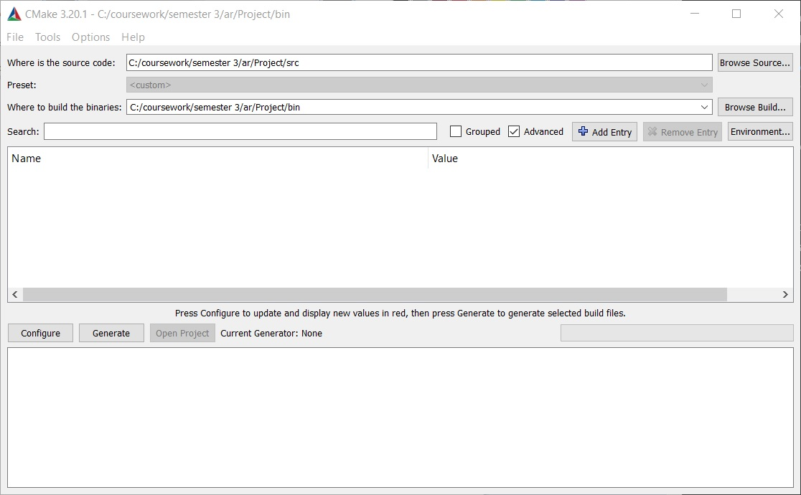
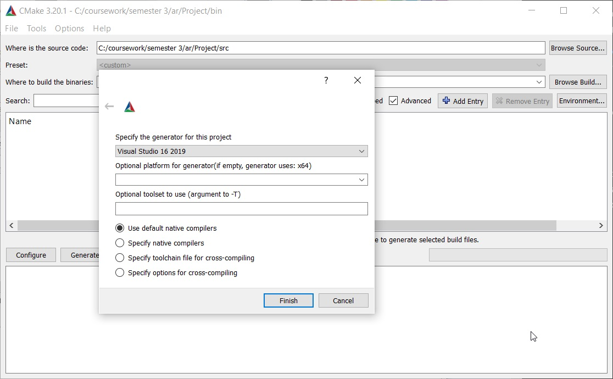
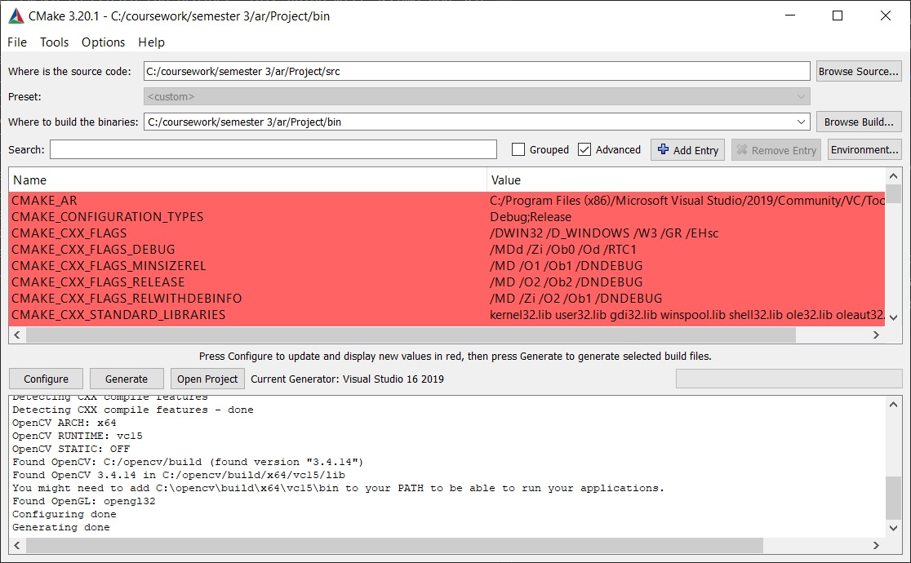
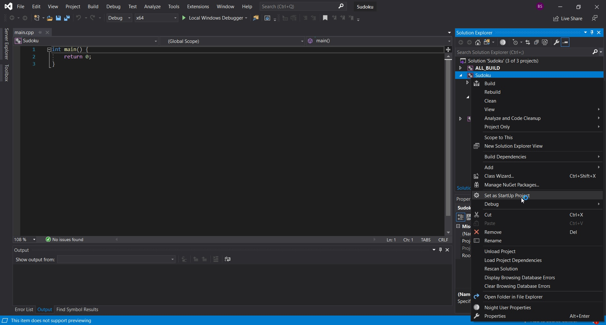

# Setup
This project is configured using CMake, so you would need to install CMake to create the project. This guide will assume you are using Windows.

1. Install CMake here: https://cmake.org/download/
2. You will need OpenCV installed on your machine.  Download OpenCV here https://opencv.org/releases/. Extract the content to a folder that you can access easily (i.e. C:/opencv).
3. Windows Environment Variable: Under Environment Variables in settings edit PATH underSystem Variables and add C:\OpenCV_3_4_14\opencv\build\x64\vc15\bin--> Reboot!
4. Clone this project.
5. Open the project folder, navigate to src. Open opencv.cmake with a text editor and change the path to wherever you installed OpenCV.
6. Create a new folder called bin in the project directory.
7. Launch CMake GUI, and set the source folder to src and binary folder to bin as followed:

8. Click on the Configure button.

9. Click on the finish button and then press generate.

10. You should have Visual Studio project ready in the bin folder now. Navigate there and launch the project.
11. Set Sudoku project as your StartUp project and you should be ready to go.
